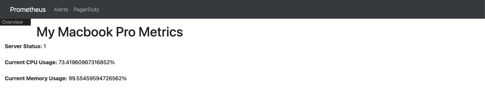
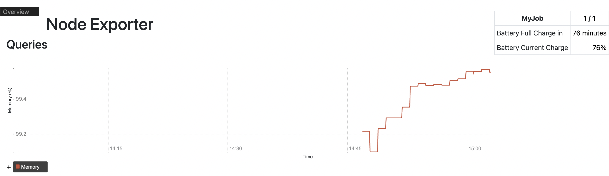
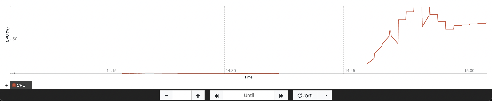

# [Limedrop Monitoring Sample](https://acloudguru.com/hands-on-labs/building-a-prometheus-console-template)


## Prerequisites
 - Docker
 - Docker Compose

### Getting Started

```shell
$ wget https://github.com/prometheus/node_exporter/releases/download/v1.3.1/node_exporter-1.3.1.darwin-amd64.tar.gz
$ tar -xvzf ~/Downloads/node_exporter-1.3.1.darwin-amd64.tar.gz -C /var/tmp/
$ /var/tmp/node_exporter-1.3.1.darwin-amd64/node_exporter
$ cd /path/to/limedrop-monitoring
$ docker-compose up -d
```

Open your browser
Visit this [link](http://localhost:9091/consoles/limedrop-web.html)

### How does it look?




